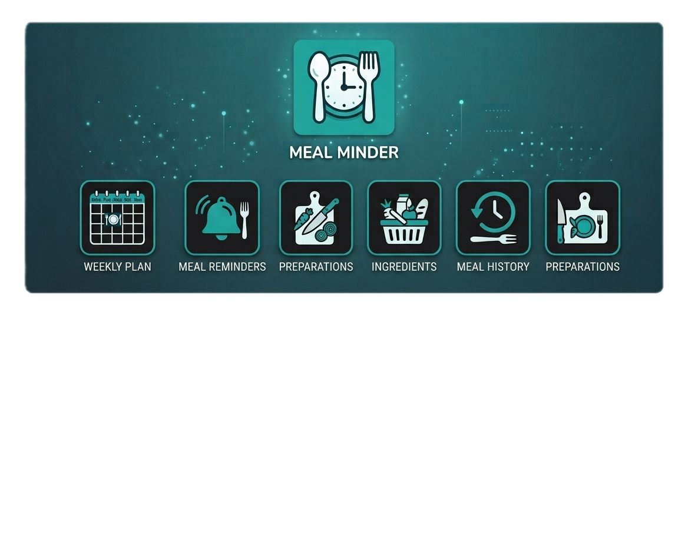

<p align="center">
  
</p>

<h1 align="center">🍽️ Meal Minder</h1>

<p align="center">
Smart meal planner for Home Assistant
</p>

<p align="center">
  
</p>

## Screenshots

<p align="center">
  
</p>

<p align="center">


</p>

---

## About

**Meal Minder** is a Home Assistant custom integration that brings meal planning directly into your smart home.

Create diet plans, schedule recurring meals, receive preparation reminders, and integrate your daily nutrition with Home Assistant automations.

Meal Minder has been designed to become the central hub for meal organization inside Home Assistant.

---

## Current Features

### Meal Planning

- ✅ Multiple meal plans
- ✅ Active meal plan selection
- ✅ Weekly recurring meals
- ✅ Date-specific meals
- ✅ Meal CRUD management
- ✅ Breakfast, Lunch and Dinner support

### Calendar

- ✅ Home Assistant Calendar entity
- ✅ Daily meal schedule
- ✅ Meal descriptions
- ✅ Automatic calendar updates

### Sensors

- ✅ Next meal
- ✅ Next meal timestamp
- ✅ Next preparation reminder

### Preparation

- ✅ Preparation offsets
- ✅ Preparation task list
- ✅ Automation-ready reminders

### Services

- ✅ Add meal
- ✅ Update meal
- ✅ Remove meal
- ✅ Export configuration
- ✅ Import configuration

### Storage

- ✅ Persistent storage
- ✅ Automatic backup before import
- ✅ JSON export/import
- ✅ Versioned export format

### Diagnostics

- ✅ Diagnostics support
- ✅ Safe diagnostic export

---

## Example

```
20:00 🍽 Dinner

• Chicken breast
• Potatoes
• Salad

Preparation:
• Take meat out of freezer
• Prepare vegetables
```

---

## Installation

### HACS (Recommended)

1. Add this repository as a Custom Repository.
2. Search for **Meal Minder**.
3. Install.
4. Restart Home Assistant.

---

### Manual Installation

Copy:

```
custom_components/meal_minder
```

into

```
config/custom_components/
```

Restart Home Assistant.

---

## Roadmap

### ✅ Alpha

- [x] Meal plans
- [x] Weekly meals
- [x] Date exceptions
- [x] Calendar entity
- [x] Next meal sensor
- [x] Preparation reminder sensor
- [x] Export / Import
- [x] Diagnostics
- [x] HACS support

### 🚧 Beta

- [ ] Lovelace cards
- [ ] Shopping list integration
- [ ] Companion App notifications
- [ ] Translation files
- [ ] Documentation improvements

### 🚀 Stable

- [ ] Recipe support
- [ ] Pantry management
- [ ] AI meal suggestions
- [ ] Nutrition information
- [ ] Multi-user support

---

## Contributing

Contributions, bug reports and feature requests are welcome.

If you have ideas to improve Meal Minder, feel free to open an Issue or a Pull Request.

---

## License

Meal Minder is released under the **GNU GPL v3**.

Commercial use requires a separate licensing agreement.

---

> ⚠️ **Alpha software**
>
> Meal Minder is under active development.
> Features, storage format and APIs may change until the first stable release.